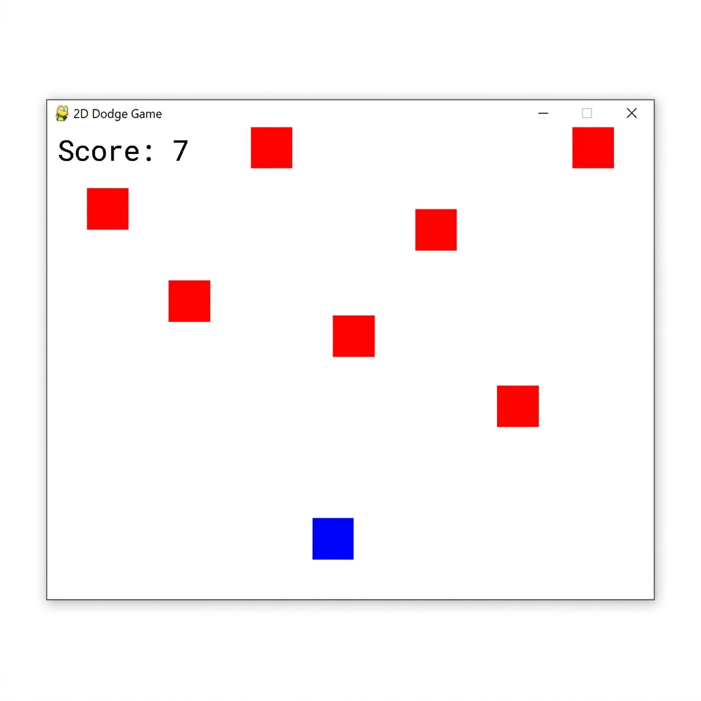
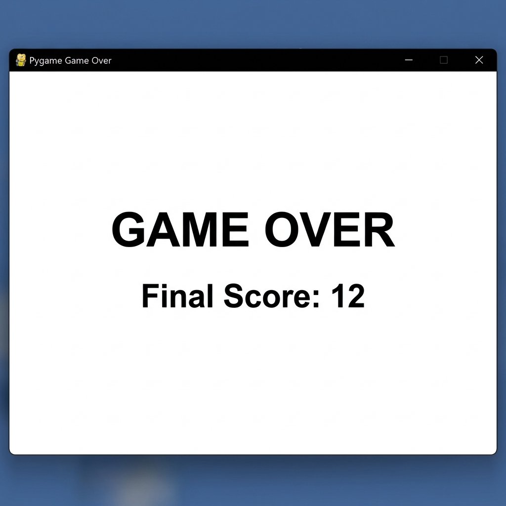

# 🎮 2D Box Dodge Game — Built with Python & Pygame

A beginner-friendly 2D dodge game developed using **Python** and **Pygame**. This project helped me learn game loops, keyboard controls, collision detection, and basic animation.

---

## 📸 Screenshots

### Gameplay


### Game Over Screen


---

## 🕹️ How to Play

- Use **← / →** arrow keys (or **A / D**) to move the blue box left and right
- **Dodge** the falling red enemy boxes
- Each enemy that passes you scores **+1 point**
- The game ends when an enemy **hits your box**

---

## 🚀 Getting Started

### Prerequisites
Make sure you have Python and Pygame installed:
```bash
pip install pygame
```

### Run the Game
```bash
python 2D_box_game_basic.py
```

---

## 🧠 What I Learned

- Setting up a **Pygame game loop**
- Handling **keyboard input** for player movement
- Spawning and moving **enemy objects**
- Implementing **collision detection** using `pygame.Rect`
- Keeping score and displaying a **game over screen**

---

## 📁 Project Structure

```
boxGame_using_pygame/
├── 2D_box_game_basic.py   # Main game file
├── screenshots/
│   ├── gameplay.png       # In-game screenshot
│   └── game_over.png      # Game over screen
└── README.md
```

---

## 🛠️ Built With

- **Python 3.x**
- **Pygame**
